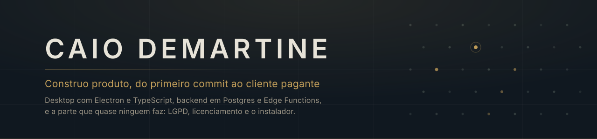

  

  
  

 

Construo software que precisa sobreviver fora da minha máquina: instalador que
roda no Windows de outra pessoa, banco que isola um cliente do outro, licença que
não dá para burlar com o inspetor do navegador, texto legal que aguenta a LGPD.

A maior parte do meu trabalho é privada. O que dá para mostrar está abaixo.

 

## No que estou trabalhando

<table>
<tr>
<td width="120" valign="top">
  
</td>
<td valign="top">

### [Argos](https://github.com/caiobelatodemartine-cmd/argos)

**Prospecção B2B local para Windows.** Encontra empresas reais por nicho e cidade,
cruza com o cadastro de CNPJ da Receita Federal, pontua o encaixe com IA e monta
listas prontas para contato.

Electron e React na frente, SQLite cifrado na máquina do cliente, Supabase apenas
para conta e direito de uso. O envio nunca é automático: a busca para em `review` e
o disparo exige confirmação manual, porque outreach automático queima o domínio de
quem comprou.

Electron · React · TypeScript · SQLite · Supabase · Stripe · Gmail API · 691 testes

</td>
</tr>
</table>

 

## Stack

| Camada | O que eu uso |
| --- | --- |
| **Desktop** | Electron, React, Vite, TypeScript, Tailwind |
| **Backend** | Postgres com RLS, Edge Functions em Deno, Supabase Auth |
| **Dados** | SQLite com better-sqlite3, Drizzle, AES-256-GCM para PII |
| **Integrações** | Stripe, Gmail API, OpenStreetMap, Apify, Claude, GPT, Gemini |
| **Web** | HTML e CSS escritos à mão, CSP estrita, Apache |
| **Teste** | Vitest, Playwright, red team multiagente |

 

## Como eu trabalho

**Lógica pura no contrato, efeito colateral na borda.** Quota, licença e template
não tocam disco nem rede, então rodam em teste sem subir a aplicação. É o que
permite uma suíte de centenas de testes que roda em segundos.

**O comentário explica a decisão, não o código.** Se está escrito no arquivo, é
porque alguém no futuro ia desfazer aquilo sem saber o que quebra.

**Segurança é fronteira, não camada.** O que o servidor não guarda não vaza. O que
é verificado por assinatura não se falsifica apontando o domínio para `localhost`.

**Nenhum segredo entra no Git.** Nem uma vez, nem em branch de teste. O histórico
guarda para sempre.

 

---

  
    Fale comigo por <a href="https://argosleads.com">argosleads.com</a>.
  

